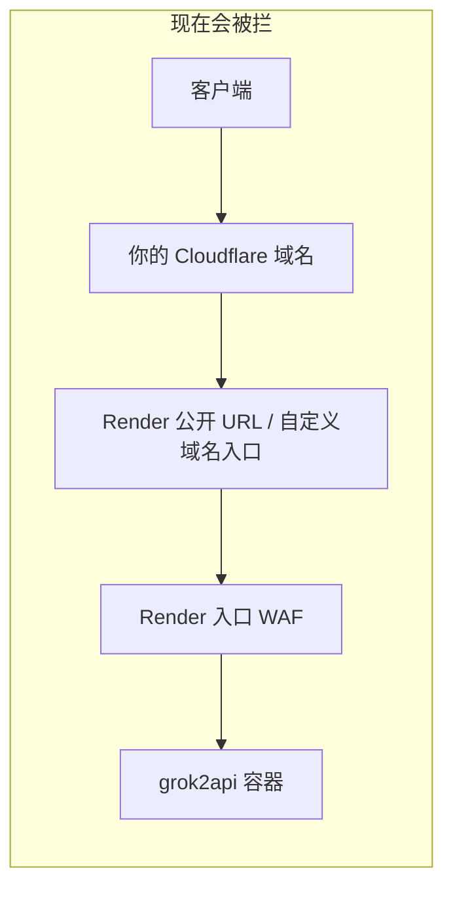
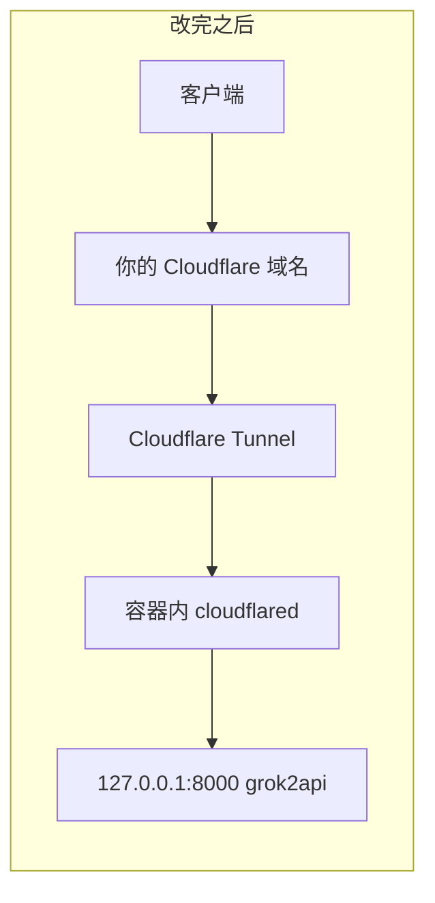

# 用 Cloudflare Tunnel 在 Render 上部署 grok2api

适合第一次接触 Render / Cloudflare 的人。按顺序做，不要跳步。

这份教程解决的问题：

- 域名已经挂在 Cloudflare 上
- 服务部署在 Render
- 访问走的是 **访客 → Cloudflare 域名 → Render 公开入口 → Render WAF → 容器**
- Render 入口的 WAF 会按关键词拦截 grok2api 的请求体（模型名、提示词等）
- Render 免费套餐关不掉这个入口 WAF

改完之后流量变成：

- 访客 → **你自己的 Cloudflare 边缘** → 容器里的 `cloudflared` → 本机 `127.0.0.1:8000` 上的 grok2api
- 请求不再经过 Render 的 HTTP 入口，Render WAF 看不到 API 正文

Render 还在跑容器（CPU、内存、出网），只是不再当网站门面。





仓库里的 Docker 镜像已经会在检测到隧道令牌时自动启动 `cloudflared`。你要做的是：写配置、在 Cloudflare 建隧道、在 Render 填环境变量。

---

## 0. 先分清两个 WAF

| 谁的 WAF | 你能不能改 | 改完隧道后还在不在路径上 |
|---|---|---|
| **Render 入口 WAF**（挡在 `*.onrender.com` 和绑到 Render 的自定义域名前面） | 免费用户不能关 | **不在了**，这正是本教程要绕开的 |
| **你自己 Cloudflare 站点上的 WAF / Bot Fight** | 能改 | **还在**。访客仍先到你的 Cloudflare 边缘，再进隧道 |

如果改完隧道后仍然 403，先看响应头里有没有 `cf-ray`，以及拦截页是不是你自己 Cloudflare 后台的规则，而不是 Render。

---

## 1. 你需要提前准备

1. 一个已经接入 Cloudflare 的域名（Nameserver 已经是 Cloudflare 的那种）。
2. 一个 GitHub 账号，并且这个 grok2api 仓库在你自己的 fork 里（Render 要从 GitHub 拉代码构建）。
3. 一个 Render 账号，免费 Web Service 即可。
4. 一台能打开浏览器的电脑。Windows 用户后面生成密钥可以用 PowerShell。

不需要：

- 买 Render 付费套餐（能用，但不是必须）
- 在 Render 里再绑定一次自定义域名
- 自己会写 Go / Docker

建议额外准备：

- 一个免费 PostgreSQL（Neon、Supabase 都可以）。Render 免费实例**没有持久磁盘**，SQLite 会在休眠、重启、重新部署时丢失。

---

## 2. 本仓库已经替你改好的部分

构建镜像时会带上 `cloudflared`。容器启动时：

| 环境变量 / 文件 | 作用 |
|---|---|
| `PORT` | grok2api 监听端口，Render 上必须设成 `8000` |
| `TUNNEL_TOKEN` 或 `CLOUDFLARE_TUNNEL_TOKEN` | Cloudflare 隧道令牌。有值才启动 `cloudflared` |
| `/etc/secrets/TUNNEL_TOKEN` | 令牌不想放环境变量时，用 Render Secret File |
| `/run/grok2api/config.yaml` 或 `/etc/secrets/config.yaml` | 运行配置 |
| `TUNNEL_TRANSPORT_PROTOCOL` | 默认 `http2`。Render 出网 UDP 不稳定时不要改成 `quic` |

没有令牌时，行为和以前一样，只跑 grok2api。

Cloudflare 控制台里「Published application」的 Service URL 必须写成：

```text
http://127.0.0.1:8000
```

这是容器内部地址，不是 `https://你的域名`，也不是 `xxx.onrender.com`。

---

## 3. 本地准备一份 `config.yaml`

在项目根目录：

```powershell
copy .\config.example.yaml .\config.yaml
```

用 PowerShell 生成两把密钥：

```powershell
python -c "import secrets,base64; print(secrets.token_hex(32)); print(base64.b64encode(secrets.token_bytes(32)).decode())"
```

没有 Python 时，可安装 Git 后用：

```powershell
openssl rand -hex 32
openssl rand -base64 32
```

打开 `config.yaml`，至少改这些（把域名换成你的）：

```yaml
server:
  listen: "0.0.0.0:8000"
  trustedProxies:
    - "127.0.0.1"
    - "::1"
  swaggerEnabled: false

auth:
  secureCookies: true

secrets:
  jwtSecret: "这里粘贴 hex 密钥，至少 32 个字符"
  credentialEncryptionKey: "这里粘贴 base64 密钥"

bootstrapAdmin:
  username: "admin"
  password: "换成足够长的随机密码"

frontend:
  staticPath: "./frontend/dist"
  publicApiBaseURL: "https://api.你的域名.com"

database:
  driver: sqlite
  sqlite:
    path: "./data/backend.db"
```

说明：

- `trustedProxies` 必须包含 `127.0.0.1`。隧道从本机把请求转进来，不写的话审计里的客户端 IP 会全是 `127.0.0.1`。
- `secureCookies: true` 是因为访客走 HTTPS。
- `publicApiBaseURL` 填最终给客户端用的 `https://` 域名，不要填 `onrender.com`。
- 有外部 Postgres 时改成：

```yaml
database:
  driver: postgres
  postgres:
    dsn: "postgres://用户:密码@主机:5432/库名?sslmode=require"
```

也可以不写 DSN，到 Render 里用环境变量 `GROK2API_DATABASE_URL` 注入。

首次登录并确认管理员能进后台后，把 `bootstrapAdmin` 整段删掉，重新上传这份 Secret File，避免密码一直躺在配置里。

`credentialEncryptionKey` 第一次写入账号后不要换，换了旧账号全部无法解密。

---

## 4. 在 Cloudflare 创建隧道

用**远程管理隧道**（控制台创建，容器只拿令牌）。不要用本机 `cloudflared login` 那套，Render 容器里没有你的登录态。

### 4.1 打开隧道页

浏览器登录 Cloudflare，任选一条能看见的路径：

- **Networking → Tunnels**
- 或 **Zero Trust → Networks → Connectors / Tunnels**

点 **Create a tunnel**。

### 4.2 创建

1. 类型选 **Cloudflared**。
2. 名字填 `grok2api-render`（随便，能认出就行）。
3. 点 **Create Tunnel** / **Save tunnel**。

### 4.3 复制令牌

页面会给出一段安装命令，类似：

```bash
cloudflared tunnel --no-autoupdate run --token eyJ...很长一串...
```

`--token` 后面那整段以 `eyJ` 开头的字符串就是 `TUNNEL_TOKEN`。

- 整段复制，不要少字符
- 不要发到群里、不要提交到 GitHub、不要贴进本教程以外的 issue
- 任何人拿到令牌都能把隧道接到自己的机器上

如果当时没复制：打开这条隧道 → **Add a replica**（或安装命令处）→ 再复制一次。

先把令牌粘到一个本地记事本，等会儿填进 Render。

这一步**先不要**在你的电脑上运行安装命令。令牌要给 Render 容器用。

### 4.4 发布到你的域名

打开刚建的隧道 → **Routes** / **Published application routes** → **Add route** → **Published application**。

| 字段 | 填什么 | 例子 |
|---|---|---|
| Subdomain | 你要用的主机名，根域名就留空或填 `@` | `api` |
| Domain | 下拉选择已经接入 Cloudflare 的域名 | `example.com` |
| Path | 留空 | |
| Service type / URL | `HTTP` + `127.0.0.1:8000` | `http://127.0.0.1:8000` |

点保存。

Cloudflare 会在 DNS 里写一条指向 `*.cfargotunnel.com` 的 CNAME，并且是**已代理**（橙色云）。这是正确状态。

### 4.5 删掉指向 Render 的旧 DNS

打开 **DNS → Records**，找到以前指向 Render 的记录，例如：

| 类型 | 名称 | 内容 | 要不要留 |
|---|---|---|---|
| CNAME | `api` | `xxx.onrender.com` | **删掉** |
| CNAME | `api` | `随机ID.cfargotunnel.com` 且橙色云 | **留下**（隧道刚写的） |
| A / CNAME | `@` 或 `www` | 其它网站 | 不动 |

关键点：

- 域名如果还 CNAME 到 `onrender.com`，访客仍会进 Render 入口 WAF。
- 不要在 Render 控制台再「Add Custom Domain」绑同一个主机名。
- `xxx.onrender.com` 这个 Render 自带地址可以留着，后面免费套餐保活用，不要把它当 API 入口发给客户端。

### 4.6 站点开关

在这个域名的 Cloudflare 控制台再检查：

1. **SSL/TLS** 加密模式用 **Full**（不要用 Flexible）。隧道到容器是 HTTP，Cloudflare 到访客是 HTTPS，这是官方用法。
2. **Network → WebSockets** 保持开启（语音 Realtime 需要）。
3. **Security → Bots**：Bot Fight Mode / Super Bot Fight 会对 API 客户端弹验证码。对这个主机名关掉，或加一条跳过规则覆盖 `/v1/*`、`/api/*`。
4. 你自己站点上如果有自定义 WAF 规则按关键词拦 `grok`、`prompt` 之类，给这个主机名加 Skip。

---

## 5. 把代码推到你自己的 GitHub

Render 免费实例从 GitHub 构建。确认 `Dockerfile`、`docker/entrypoint.sh` 已经包含隧道改动，再推到**你的 fork**，不要推到原作者仓库。

本仓库已有脚本：

```powershell
.\save-local.cmd "支持 Cloudflare Tunnel 绕过 Render WAF"
.\push-to-fork.cmd
```

`push-to-fork` 会要求你输入 `YES` 才上传。详细说明见 [二开使用教程.md](./二开使用教程.md)。

---

## 6. 在 Render 创建 Web Service

### 6.1 新建

1. 打开 [Render Dashboard](https://dashboard.render.com/)
2. **New → Web Service**
3. 连你的 GitHub，选 `grok2api` 这个 fork
4. 语言 / Runtime 选 **Docker**
5. Dockerfile Path 填 `./Dockerfile`
6. Instance 选 **Free**
7. Region 选离你或离出口代理近的

### 6.2 端口（必须改）

Render 默认会注入 `PORT=10000`。本教程统一用 **8000**，必须和 Cloudflare 的 Service URL 一致。

在 Environment 里新增：

| Key | Value |
|---|---|
| `PORT` | `8000` |
| `TZ` | `Asia/Shanghai` |
| `TUNNEL_TOKEN` | 第 4.3 步复制的整段 `eyJ...` |

如果界面里有 **Internal Port** / **Port**，也改成 `8000`。

### 6.3 上传 `config.yaml`

1. 同一个服务的 **Environment → Secret Files → Add Secret File**
2. Filename 填 `config.yaml`（必须叫这个名字）
3. 把本地改好的 `config.yaml` 全文粘进去
4. Save

Docker 服务运行时文件会出现在 `/etc/secrets/config.yaml`。入口脚本会自动读这个路径。

不要把 `config.yaml` 提交进 GitHub。

### 6.4 健康检查

Settings → Health Check Path 填：

```text
/healthz
```

这个路径只返回 `{"ok":true}`，不含 grok 关键词，Render 入口探活一般不会被自己的 WAF 误杀。

### 6.5 不要做的事

- 不要在 Render 再绑定这个自定义域名
- 不要把 `TUNNEL_TOKEN` 写进 Dockerfile
- 不要在免费实例上开 quality-guard、FlareSolverr、Swagger
- 不要指望 SQLite 能在免费实例上长期活着

### 6.6 可选：外部数据库

有 Postgres 时再加：

| Key | Value |
|---|---|
| `GROK2API_DATABASE_URL` | `postgres://用户:密码@主机:5432/库名?sslmode=require` |

非空时会覆盖 YAML 里的 DSN，并自动改用 postgres。

### 6.7 部署

点 **Deploy**。第一次构建要下载 Go / Node / `cloudflared`，可能要十几分钟。

日志里应当先后看到类似：

```text
cloudflared: enabled protocol=http2 origin=http://127.0.0.1:8000
cloudflared: set the published application Service URL to http://127.0.0.1:8000
Registered tunnel connection
server_started  listen=0.0.0.0:8000
```

Cloudflare 隧道列表里这条隧道应变为 **Healthy**。

如果只有 `server_started`、没有 `cloudflared: enabled`：令牌没进容器。检查环境变量名是不是 `TUNNEL_TOKEN`，重新部署一次。

---

## 7. Render 免费套餐必须做的保活

免费 Web Service：**连续 15 分钟没有从 Render 入口进来的流量就会休眠**。

隧道流量**不算** Render 入口流量。只把域名切到隧道后，Render 会以为这个服务没人用，把容器（以及里面的 `cloudflared`）一起睡掉。域名随后出现 Cloudflare **1033 / 1016**（隧道离线）。

任选一种保活（每 5–10 分钟一次 GET 即可）：

- [cron-job.org](https://cron-job.org/) 免费定时 HTTP
- UptimeRobot 免费监控
- 自己已有的定时器

URL 用 Render 自带地址，不要用自定义域名：

```text
https://你的服务名.onrender.com/healthz
```

这个 GET 没有模型名、没有提示词，通常过得了 Render 入口 WAF，作用只是不让容器睡。

付费 Render 实例不休眠，可以不做这一步。

免费实例还可能被平台随时重启，没有持久盘。号池、密钥、媒体文件要当「随时会丢」处理，或者改用外部 Postgres。

---

## 8. 怎么确认已经绕过 Render WAF

在自己电脑上（把域名换成你的）：

```powershell
curl https://api.你的域名.com/healthz
```

应返回：

```json
{"ok":true}
```

再用以前会被拦的调用打一次（管理端登录，或带客户端密钥的 `/v1/chat/completions`）。

对照：

| 现象 | 含义 |
|---|---|
| 自定义域名的 API 成功，`onrender.com` 的同类 POST 仍被拦 | 成功。客户端以后只用自定义域名 |
| 两个入口都被拦，响应是 Cloudflare 挑战页 | 你自己站点的 WAF / Bot Fight 在拦，去 Cloudflare 安全里放行 |
| 自定义域名 1033 / 1016 | 隧道没连上，看 Render 日志里的 cloudflared |
| 自定义域名 502 / 530 | 隧道在，但原点 `127.0.0.1:8000` 没人听。多半是 `PORT` 不是 8000 |
| 只有 `onrender.com` 能打开管理端 | DNS 还指着 Render，第 4.5 步没删干净 |

客户端、Cherry Studio、OpenAI SDK 的 Base URL 一律填：

```text
https://api.你的域名.com/v1
```

不要再填 `https://xxx.onrender.com/v1`。

---

## 9. 管理端和 Cookie

用 `https://api.你的域名.com` 打开管理端。

如果登录后 Cookie 丢失：确认 `auth.secureCookies` 为 `true`，并且你是用 HTTPS 域名访问，不是 `http://`。

首次用 `bootstrapAdmin` 登录后，立刻改密码，并按第 3 步删掉配置里的明文密码。

---

## 10. 常见翻车点

**1. Service URL 填成了公网地址**

填 `https://api.example.com` 或 `http://xxx.onrender.com` 都会错。必须是容器内部：

```text
http://127.0.0.1:8000
```

**2. `PORT` 仍是 10000**

隧道去连 8000，进程却听在 10000。日志里会有 origin 报错。环境变量 `PORT=8000` 后需要 **Manual Deploy** 一次。

**3. 令牌复制少了字符**

`TUNNEL_TOKEN` 是很长的 JWT。重新从 Cloudflare 隧道页复制，整段粘贴。

**4. 旧 CNAME 还在**

DNS 里不能同时把同一主机名指到 `onrender.com` 和隧道。只保留隧道那条橙色云 CNAME。

**5. 免费实例睡着了**

定时 GET `https://xxx.onrender.com/healthz`。看 Render 仪表盘是不是 Spinning down。

**6. 构建拉不下来 `cloudflared`**

镜像构建会从 GitHub Releases 下载并校验 `cloudflared 2026.10.0`。构建日志若出现 wget 失败，等一会儿再 Deploy；不要改成跳过校验。

**7. 512 MB 内存打满**

免费实例只有 0.1 CPU / 512 MB。不要开 quality-guard，不要同实例塞 Redis / FlareSolverr。内存打满会 137 退出，隧道跟着断。

**8. 流式对话中途断开**

Cloudflare 免费边缘对空闲 HTTP 连接大约 100 秒。模型长时间不吐 token 可能被断开。这是 Cloudflare 边缘限制，不是 Render WAF。有持续输出时一般能撑住。

**9. 语音 Realtime 连不上**

确认 Cloudflare WebSockets 开启，Service URL 仍是 `http://127.0.0.1:8000`（不要单独再开一条 wss 原点）。

**10. 审计 IP 全是 127.0.0.1**

`server.trustedProxies` 没写 `127.0.0.1`。改 Secret File 后重启服务。

---

## 11. 安全建议

- 对外只公布 Cloudflare 域名，不要公布 `onrender.com`。
- `onrender.com` 仍暴露在公网，只给探活用。真正鉴权靠 grok2api 的管理员登录和客户端密钥。
- 定期轮换隧道令牌：Cloudflare 隧道页重新生成后，更新 Render 的 `TUNNEL_TOKEN` 并重新部署。
- 不要把令牌、`config.yaml`、数据库导出提交进 Git。
- 你自己的 Cloudflare 站点可以开 WAF，但不要用关键词规则误杀 `/v1/*`。

---

## 12. 以后升级代码

1. 本地 `.\sync-upstream.cmd` 收原作者更新（不会上传）。
2. 解决冲突后 `.\save-local.cmd "说明"`。
3. `.\push-to-fork.cmd` 并输入 `YES`。
4. Render 连着这个 fork 的话会自动构建。
5. 确认新镜像日志里仍有 `cloudflared: enabled`。

`Dockerfile` 里的 `CLOUDFLARED_VERSION` 需要人工升级；升级时同步改两行 sha256（amd64 / arm64），不要只改版本号。

---

## 13. 和「域名橙云指向 Render」有什么本质区别

| | 橙云 CNAME 到 Render | Cloudflare Tunnel |
|---|---|---|
| 访客 HTTPS | 有 | 有 |
| 请求体是否经过 Render 入口 | 经过，会被 WAF 扫 | 不经过 |
| 容器要不要监听公网端口 | 要，Render 反代进来 | 仍听 `0.0.0.0:8000`，但公网 API 不走它 |
| 免费实例休眠 | 有人访问自定义域名可续命 | 必须另 ping `onrender.com/healthz` |
| 你自己 Cloudflare 的规则 | 生效 | 同样生效 |

本项目需要的是第二列。
